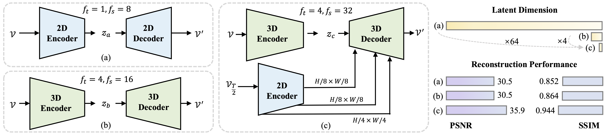

# Reducio-VAE

Welcome to the official repository for **Reducio Variational Autoencoder (Reducio-VAE)**! [Reducio-VAE](https://arxiv.org/abs/2411.13552) is a model for encoding videos into an extremely small latent space. It is part of the Reducio-DiT, which is a highly efficient video generation method. Reducio-VAE encodes a 16-frame video clip to $T/4\*H/32\*W/32$ latent space based on a content image prior, which enables 4096x compression rate on the videos. More details can be found in the paper.


[](https://arxiv.org/abs/2411.13552) [](https://huggingface.co/microsoft/Reducio-VAE)  


## WHAT CAN REDUCIO-VAE DO
Reducio-VAE was developed to enable high compression ratio on videos, supporting efficient video generation. Existing 3D VAEs are generally extended from 2D VAE, which is designed for image generation and has large redundancy when handling video. Compared to 2D VAE, Reducio-VAE achieved 64x higher compression ratio.
<p align="center">

</p>


A detailed discussion of Reducio-VAE, including how it was developed and tested, can be found in our [paper](https://arxiv.org/abs/2411.13552).

## Intended uses
Reducio-VAE is best suited for supporting training your own video diffusion model for research purpose.

## Out-of-scope uses
Reducio-VAE is not well suited for processing long videos. It currently can only handle 1-second video clips.

We do not recommend using Reducio-VAE in commercial or real-world applications without further testing and development. It is being released for research purposes.

Reducio-VAE was not designed or evaluated for all possible downstream purposes. Developers should consider its inherent limitations (more below) as they select use cases, and evaluate and mitigate for accuracy, safety, and fairness concerns specific to each intended downstream use.

We do not recommend using Reducio-VAE in the context of high-risk decision making (e.g. in law enforcement, legal, finance, or healthcare).


## Installation
Set up the environment with
```
pip3 install -r requirements.txt
```


## Training

### Training Method
Training data was prepared by self-collecting. We recommend using Pexels or other high-quality videos.

We directly trained Reducio-VAE from scratch on $256\*256$ resolution with 16 FPS. No further fine-tuning on $512\*512$ or $1024\*1024$. To use it on higher resolution, we split videos into tiles in spatial dimensions.

### Training Scripts
```
# training Reducio-VAE-ft4-fs32
python -m torch.distributed.launch --nproc_per_node=${GPU_PER_NODE_COUNT} \
--node_rank=${NODE_RANK} \
--nnodes=${NODE_COUNT} \
--master_addr=${MASTER_ADDR} \
--master_port=${MASTER_PORT} \
--use_env main.py \
-b configs/autoencoder/reducio_kl_ft4_fs32_z16_attn23.yaml \
-t -r ${output_dir} -k ${wandb_key}
```

# Inference Scripts
```
# Inference with our pre-trained weights
python -m torch.distributed.launch --nproc_per_node=${GPU_PER_NODE_COUNT} \
--master_addr=${MASTER_ADDR} \
--master_port=${MASTER_PORT} \
main.py -r ${output_dir} -t False \
-b configs/autoencoder/reducio_kl_ft4_fs32_z16_attn23.yaml \
--pretrained checkpoint/reducio-ft4-fs32-attn23.ckpt \ 
-k ${wandb_key}
```
Users can adjust the `batch_frequency` params of  `Image_logger` in the config. Below is an example of logged input videos (top) sampled from [Pexels](https://www.pexels.com/) and reconstructed results (bottom) by Reducio-VAE :
<p align="center">

</p>


## Model Zoo
| name |  $f_t$ | $f_s$ |  checkpoint |
|:---:|:---:|:---:|:---:|
 Reducio-VAE | 2 | 32 | [huggingface](https://huggingface.co/microsoft/Reducio-VAE/blob/main/reducio-ft2-fs32-attn23.ckpt) |
| Reducio-VAE | 4 | 32 | [huggingface](https://huggingface.co/microsoft/Reducio-VAE/blob/main/reducio-ft4-fs32-attn23.ckpt) |

## Evaluation

Reducio-VAE performed best on high-quality videos, but worse on low-quality videos like UCF-101. The reason is that the visual quality of UCF-101 is low, where the prior content image is blurring in many cases.

Metrics on 1K Pexels validation set and UCF-101: 

|Method|Downsample Factor|$\|z\|$|PSNR |SSIM |LPIPS |rFVD (Pexels)|rFVD (UCF-101)|
|---------|---------------------|------------------|------------|--------------------|--------------|----------------|------------|
|SD2.1-VAE|$1\times8\times8$|4|29.23|0.82|0.09|25.96|21.00| 
|SDXL-VAE|$1\times8\times8$|16|30.54|0.85|0.08|19.87|23.68|
|OmniTokenizer|$4\times8\times8$|8|27.11|0.89|0.07|23.88|30.52|
|OpenSora-1.2|$4\times8\times8$|16|30.72|0.85|0.11|60.88|67.52|
|Cosmos Tokenizer|$8\times8\times8$|16|30.84|0.74|0.12|29.44|22.06|
|Cosmos Tokenizer|$8\times16\times16$|16|28.14|0.65|0.18|77.87|119.37|
|Reducio-VAE|$4\times32\times32$|16|35.88|0.94|0.05|17.88|65.17|


## Limitations
Reducio-VAE was developed for research and experimental purposes. Further testing and validation are needed before considering its application in commercial or real-world scenarios.

Currently, Reducio-VAE can only encode 16-frame video clips. Longer length is not supported.

## Ethics Statement
This work is purely a research project. Currently, we have no plans to incorporate it into a product or expand access to the public. We will also put Microsoft AI principles into practice when further developing the models. In our research paper, we account for the ethical concerns associated with text-image-to-video research. To mitigate issues associated with training data, we have implemented a rigorous filtering process to purge our training data of inappropriate content, such as explicit imagery and offensive language, to minimize the likelihood of generating inappropriate content. 

## License
The code and model are licensed under the MIT license.

## Acknowledgements

Our code is built on top of [Stable Diffusion](https://github.com/CompVis/stable-diffusion). We would like to thank the SD team for their foundational work.

## Citation

If you use our work, please cite:

```
@article{tian2024reducio,
  title={REDUCIO! Generating 1024*1024 Video within 16 Seconds using Extremely Compressed Motion Latents},
  author={Tian, Rui and Dai, Qi and Bao, Jianmin and Qiu, Kai and Yang, Yifan and Luo, Chong and Wu, Zuxuan and Jiang, Yu-Gang},
  journal={arXiv preprint arXiv:2411.13552},
  year={2024}
}
